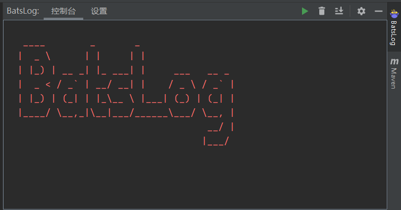

# mybatis 日志插件 BatsLog
@[toc]
>分享一个免费的mybatis日志插件[idea插件](https://plugins.jetbrains.com/plugin/15301-batslog)
## 主要功能
1. 选取SQL格式化输出SQL
2. 自动监听读取打印的SQL日志，并格式化输出
3. 直接复制格式化后的SQL到剪贴板（可以自己设置快捷键）
4. 支持多种数据库（MySQL、Oracle、SqlServer……）
5. 支持外部日志格式化
6. 期待你点击[这里](https://github.com/PerccyKing/batslog/issues)提出需求

## 功能展示
### 主界面

### 中文支持

### 复制SQL功能

### 自动监听功能

## 其他
请将你遇到的问题写在[这里](https://github.com/PerccyKing/batslog/issues)，我将尽力为你解决

## github
[开源代码](https://github.com/PerccyKing/batslog)
[下载插件](https://plugins.jetbrains.com/plugin/15301-batslog)

## 交流群

